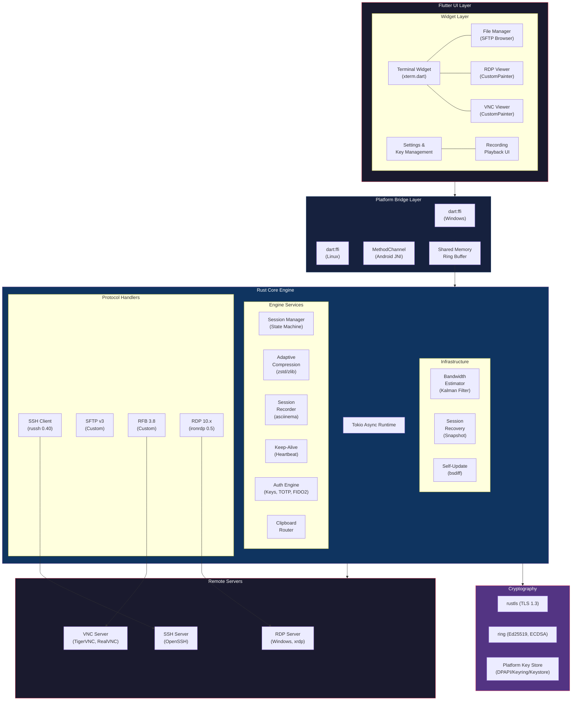
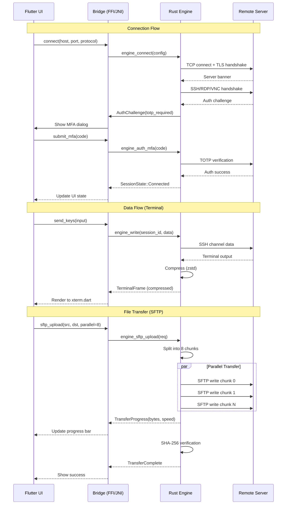
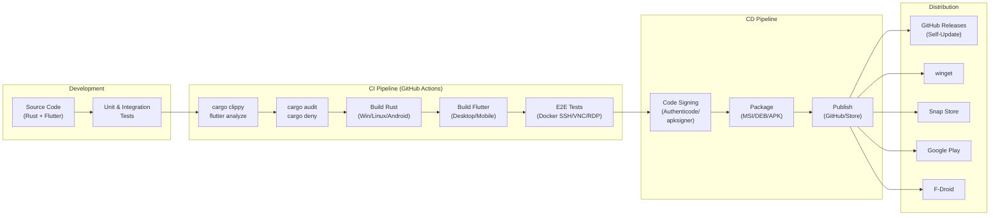

# BlueSSH — Technology Stack Diagram

## System Architecture (Mermaid)

```mermaid
graph TB
    subgraph UI["Flutter UI Layer"]
        direction TB
        Terminal["Terminal Widget<br/>(xterm.dart)"]
        FileManager["File Manager<br/>(SFTP Browser)"]
        RDPView["RDP Viewer<br/>(CustomPainter)"]
        VNCView["VNC Viewer<br/>(CustomPainter)"]
        Settings["Settings &<br/>Key Management"]
        Recording["Recording<br/>Playback UI"]

        subgraph Widgets["Widget Layer"]
            Terminal --- FileManager
            Terminal --- RDPView
            Terminal --- VNCView
            Settings --- Recording
        end
    end

    subgraph Bridge["Platform Bridge Layer"]
        FFI_Win["dart:ffi<br/>(Windows)"]
        FFI_Lin["dart:ffi<br/>(Linux)"]
        MethodCh["MethodChannel<br/>(Android JNI)"]
        SharedMem["Shared Memory<br/>Ring Buffer"]
    end

    subgraph Engine["Rust Core Engine"]
        direction TB
        Tokio["Tokio Async Runtime"]

        subgraph Protocols["Protocol Handlers"]
            SSH["SSH Client<br/>(russh 0.40)"]
            SFTP["SFTP v3<br/>(Custom)"]
            VNC["RFB 3.8<br/>(Custom)"]
            RDP["RDP 10.x<br/>(ironrdp 0.5)"]
        end

        subgraph Services["Engine Services"]
            SessionMgr["Session Manager<br/>(State Machine)"]
            Compressor["Adaptive<br/>Compression<br/>(zstd/zlib)"]
            Recorder["Session<br/>Recorder<br/>(asciinema)"]
            KeepAlive["Keep-Alive<br/>(Heartbeat)"]
            Auth["Auth Engine<br/>(Keys, TOTP, FIDO2)"]
            Clipboard["Clipboard<br/>Router"]
        end

        subgraph Infra["Infrastructure"]
            Bandwidth["Bandwidth<br/>Estimator<br/>(Kalman Filter)"]
            Recovery["Session<br/>Recovery<br/>(Snapshot)"]
            Update["Self-Update<br/>(bsdiff)"]
        end
    end

    subgraph Crypto["Cryptography"]
        Rustls["rustls (TLS 1.3)"]
        Ring["ring (Ed25519, ECDSA)"]
        KeyStore["Platform Key Store<br/>(DPAPI/Keyring/Keystore)"]
    end

    subgraph Remote["Remote Servers"]
        SSHServer["SSH Server<br/>(OpenSSH)"]
        VNCServer["VNC Server<br/>(TigerVNC, RealVNC)"]
        RDPServer["RDP Server<br/>(Windows, xrdp)"]
    end

    UI --> Bridge
    Bridge --> SharedMem
    SharedMem --> Engine
    Engine --> Crypto
    Engine --> Remote

    SSH --> SSHServer
    VNC --> VNCServer
    RDP --> RDPServer

    style UI fill:#1a1a2e,stroke:#e94560,color:#fff
    style Bridge fill:#16213e,stroke:#0f3460,color:#fff
    style Engine fill:#0f3460,stroke:#533483,color:#fff
    style Crypto fill:#533483,stroke:#e94560,color:#fff
    style Remote fill:#1a1a2e,stroke:#e94560,color:#fff
```

## Data Flow Sequence

```mermaid
sequenceDiagram
    participant U as Flutter UI
    participant B as Bridge (FFI/JNI)
    participant E as Rust Engine
    participant S as Remote Server

    Note over U,S: Connection Flow
    U->>B: connect(host, port, protocol)
    B->>E: engine_connect(config)
    E->>S: TCP connect + TLS handshake
    S-->>E: Server banner
    E->>S: SSH/RDP/VNC handshake
    S-->>E: Auth challenge
    E->>B: AuthChallenge(totp_required)
    B->>U: Show MFA dialog
    U->>B: submit_mfa(code)
    B->>E: engine_auth_mfa(code)
    E->>S: TOTP verification
    S-->>E: Auth success
    E-->>B: SessionState::Connected
    B-->>U: Update UI state

    Note over U,S: Data Flow (Terminal)
    U->>B: send_keys(input)
    B->>E: engine_write(session_id, data)
    E->>S: SSH channel data
    S-->>E: Terminal output
    E->>E: Compress (zstd)
    E-->>B: TerminalFrame (compressed)
    B-->>U: Render to xterm.dart

    Note over U,S: File Transfer (SFTP)
    U->>B: sftp_upload(src, dst, parallel=8)
    B->>E: engine_sftp_upload(req)
    E->>E: Split into 8 chunks
    par Parallel Transfer
        E->>S: SFTP write chunk 0
        E->>S: SFTP write chunk 1
        E->>S: SFTP write chunk N
    end
    E-->>B: TransferProgress(bytes, speed)
    B-->>U: Update progress bar
    E->>E: SHA-256 verification
    E-->>B: TransferComplete
    B-->>U: Show success
```

## Deployment Pipeline

```mermaid
graph LR
    subgraph Dev["Development"]
        Code["Source Code<br/>(Rust + Flutter)"]
        Test["Unit & Integration<br/>Tests"]
    end

    subgraph CI["CI Pipeline (GitHub Actions)"]
        Lint["cargo clippy<br/>flutter analyze"]
        Audit["cargo audit<br/>cargo deny"]
        Build_Rust["Build Rust<br/>(Win/Linux/Android)"]
        Build_Flutter["Build Flutter<br/>(Desktop/Mobile)"]
        Test_E2E["E2E Tests<br/>(Docker SSH/VNC/RDP)"]
    end

    subgraph CD["CD Pipeline"]
        Sign["Code Signing<br/>(Authenticode/<br/>apksigner)"]
        Package["Package<br/>(MSI/DEB/APK)"]
        Publish["Publish<br/>(GitHub/Store)"]
    end

    subgraph Deploy["Distribution"]
        GitHub["GitHub Releases<br/>(Self-Update)"]
        Winget["winget"]
        Snap["Snap Store"]
        Play["Google Play"]
        FDroid["F-Droid"]
    end

    Code --> Test
    Test --> Lint
    Lint --> Audit
    Audit --> Build_Rust
    Build_Rust --> Build_Flutter
    Build_Flutter --> Test_E2E
    Test_E2E --> Sign
    Sign --> Package
    Package --> Publish
    Publish --> GitHub
    Publish --> Winget
    Publish --> Snap
    Publish --> Play
    Publish --> FDroid
```
